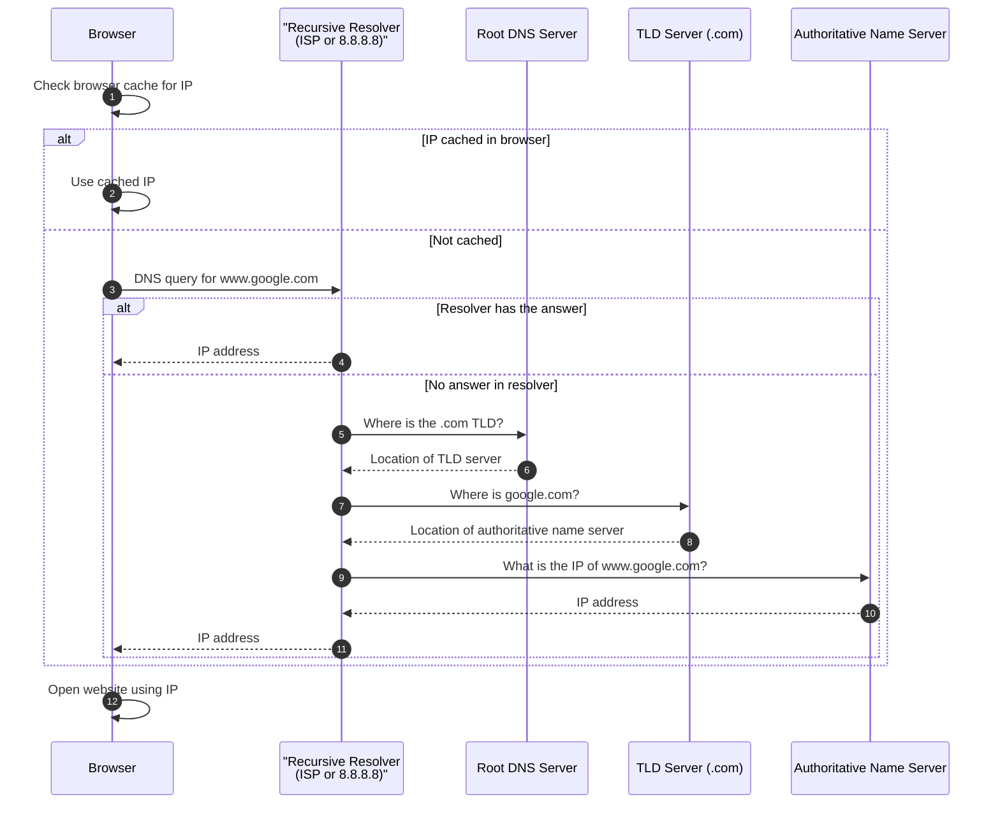

# DNS Resolution Flow

```mermaid
sequenceDiagram
    autonumber
    participant B as Browser
    participant R as "Recursive Resolver<br/>(ISP or 8.8.8.8)"
    participant Root as Root DNS Server
    participant TLD as TLD Server (.com)
    participant Auth as Authoritative Name Server

    B->>B: Check browser cache for IP
    alt IP cached in browser
        B->>B: Use cached IP
    else Not cached
        B->>R: DNS query for www.google.com
        alt Resolver has the answer
            R-->>B: IP address
        else No answer in resolver
            R->>Root: Where is the .com TLD?
            Root-->>R: Location of TLD server
            R->>TLD: Where is google.com?
            TLD-->>R: Location of authoritative name server
            R->>Auth: What is the IP of www.google.com?
            Auth-->>R: IP address
            R-->>B: IP address
        end
    end
    B->>B: Open website using IP
```
